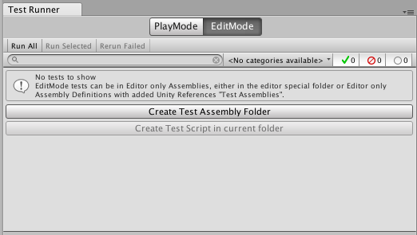
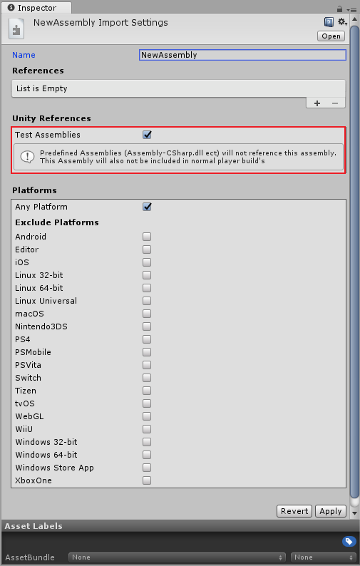
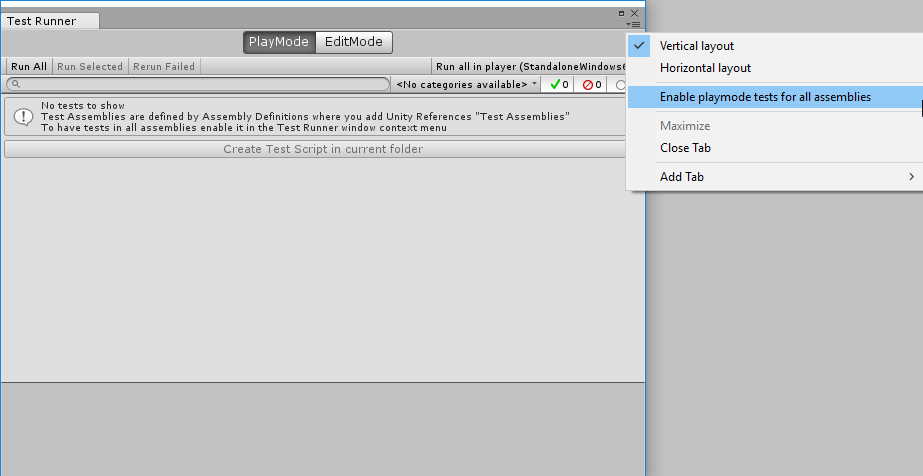

# Unity Test Runner

The Unity Test Runner is a tool that tests your code in both __Edit__ mode and __Play__ mode, and also on target platforms such as [Standalone](https://docs.unity3d.com/Manual/Standalone.html), Android, or iOS.

To access the Unity Test Runner, go to __Window__ > __Test Runner__.

The Unity Test Runner uses a Unity integration of the NUnit library, which is an open-source unit testing library for .Net languages. For more information about NUnit, see the [official NUnit website](http://www.nunit.org/) and the [NUnit documentation on GitHub](https://github.com/nunit/docs/wiki/NUnit-Documentation).

[UnityTestAttribute](https://docs.unity3d.com/ScriptReference/TestTools.UnityTestAttribute.html) is the main addition to the standard NUnit library for the Unity Test Runner. This is a type of unit test that allows you to skip a frame from within a test (which allows background tasks to finish). To use `UnityTestAttribute`:

* In __Play__ mode: Execute `UnityTestAttribute` as a [coroutine](https://docs.unity3d.com/ScriptReference/Coroutine.html).

* In __Edit__ mode: Execute `UnityTestAttribute` in the [EditorApplication.update](https://docs.unity3d.com/ScriptReference/EditorApplication-update.html) callback loop.

## Known issues and limitations

There are some known issues and limitations of the Unity Test Runner:

* The WebGL and WSA platforms do not support `UnityTestAttribute`.

* `UnityTest` does not support [Parameterized tests](https://github.com/nunit/docs/wiki/Parameterized-Tests) (except for `ValueSource`).

## How to use Unity Test Runner

This page assumes you already have an understanding of unit testing and NUnit. If you are new to NUnit or would like more information, see to the [NUnit documentation on GitHub](https://github.com/nunit/docs/wiki/NUnit-Documentation).

To open the Unity Test Runner, open Unity and go to __Window__ &gt; __Test Runner__. If there are no tests in your Project, click the __Create Test Script in current folder__ button to create a basic test script. This button is greyed out if adding a test script would result in a compilation error. The conditions for adding a test script are in the [Editor](https://docs.unity3d.com/Manual/SpecialFolders.html) folder, or any folders using Assembly Definition files that reference test assemblies (NUnit, Unity Test Runner, and user script assemblies).

You can also create test scripts by navigating to __Assets__ &gt; __Create__ &gt; __C# Test Script__. This option is disabled if adding a test script would result in a compilation error.

__Note:__ Unity does not include test assemblies (NUnit, Unity TestRunner, and user script assemblies) when using the normal build pipeline, but does include them when using "Run on &lt;Platform&gt;" in the Test Runner Window.

### Testing in Edit mode

In __Edit__ mode, Unity runs tests from the Test Runner window.

Edit mode test scripts are defined by the file location you place them in. Valid locations:

* Project [Editor](https://docs.unity3d.com/Manual/SpecialFolders.html) folder

* Assembly Definition file that references test assemblies that are Editor-only

* Precompiled assemblies that are in the Project’s [Editor](https://docs.unity3d.com/Manual/SpecialFolders.html) folder

Click the __EditMode__ button, then click __Create Test Script in current folder__ to create a basic test script. Open and edit this in your preferred script editing software as required.

Note: When running in __Edit__ mode, execute [UnityTestAttribute](https://docs.unity3d.com/ScriptReference/TestTools.UnityTestAttribute.html) in the [EditorApplication.update](https://docs.unity3d.com/ScriptReference/EditorApplication-update.html) callback loop.

### Testing in Play mode

You need to place Play mode test scripts in a folder that an Assembly Definition file includes. The Assembly Definition file needs to reference test assemblies (Nunit and Unity TestRunner). Pre-defined Unity assemblies (such as *Assembly-CSharp.dll*) do not reference the defined assembly. This Assembly Definition file also needs to reference the assembly you want to test. This means that it’s only possible to test code defined by other Assembly Definition files.

Unity does not include test assemblies in normal player builds; only when running through the Test Runner. If you need to test code in pre-defined assemblies, you can reference test assemblies from all the assemblies. However, you must manually remove these tests afterwards, so that Unity does not add them to the final player build.

To do this:

1. Save your project.

2. Go to __Window__ &gt; __Test Runner.__

3. Click the small drop-down menu in the top-right of the window.

4. Click __Enable playmode tests for all assemblies__.

5. In the dialog box appears, click __OK__ to manually restart the Editor.

__Note:__ Enabling __PlayMode__ tests for all assemblies includes additional assemblies in your Project’s build, which can increase your Project’s size as well as build time.

To create __PlayMode__ test scripts, select __PlayMode__ in the Test Runner window and click __Create Test Script in current folder__. This button is greyed out if adding the script would result in a compilation error. 

__Note__: Execute [UnityTestAttribute](https://docs.unity3d.com/ScriptReference/TestTools.UnityTestAttribute.html) as a [coroutine](https://docs.unity3d.com/ScriptReference/Coroutine.html) when running in __Play__ mode.
