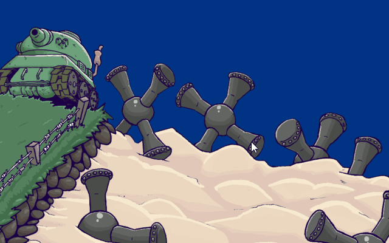

# DTerrain
Destructible terrain in Unity

Simple destructible terrain in Unity based on bitmaps and Quadtree. Pretty efficent and works with Unity Colliders. Very reusable and customizable for your own needs. This beginner friendly tool will take your game to the next level. If you want to use it, clone this repository and see example scene.




## FAQ
### How it works?
I use **Ranges**: [min;max]
Then I make a list of ranges called **Column**.
I fill those ranges using image (if color.alpha>threshold I fill it and use range to remember it effectively).
Now I have a list of **Columns** that make a single **Chunk**. **World** is made of chunks and when any changes are made to the **World** - it changes the certain chunk. 

There are many ways you can handle destruction now: if I have shape (list of **Columns**) I can manually remove each pixel, or use **ranges** of this shape to delete effectively bigger areas of terrain.

Each **Chunk** has their sub-texture made from original Texture. I found out that changing a few smaller Textures is much, much faster than changing one big texture. 

Whenever a change is made (destruction) each **Chunk** recalculates sub-textures based on their **Columns** and recreates BoxColliders2D using Quadtree to fit new terrain.

### Would it work in realtime game?
*Yes. Example scene rarely goes below ~80 FPS on my machine and it contains a medium-sized destruction every frame.*
### How I can make it work even faster?
*Increase number of chunks or reduce number of operations done on world per frame.*
*Reduce unnecessary per frame changes to the terrain as it makes chunk to recalculate it's colliders.*
*Recalculating colliders takes about 90% of all computation for DTerrain, keep that in mind.*
### I can't access any of the components from this package.
*Make sure you add ```using DTerrain;``` at the begining of you scripts.*
### Will it work with my Unity version?
*It should as code is universal and doesn't use version specific tweaks in Unity (only BoxColliders2D).*
### Can I use it for free?
*Yes. Now and forever. You don't have to credit me, but I'd really like to know if you built something meaningful with it.* 

## Special thanks:
- **/u/idbrii** for pointing out a fix that nearly doubled the FPS.

## Features in the future:
- Rewriting the whole code to be more expandable (DONE ✔️)
- Sand (IN PROGRESS 🔜)
- Adding wiki on how to use it 
